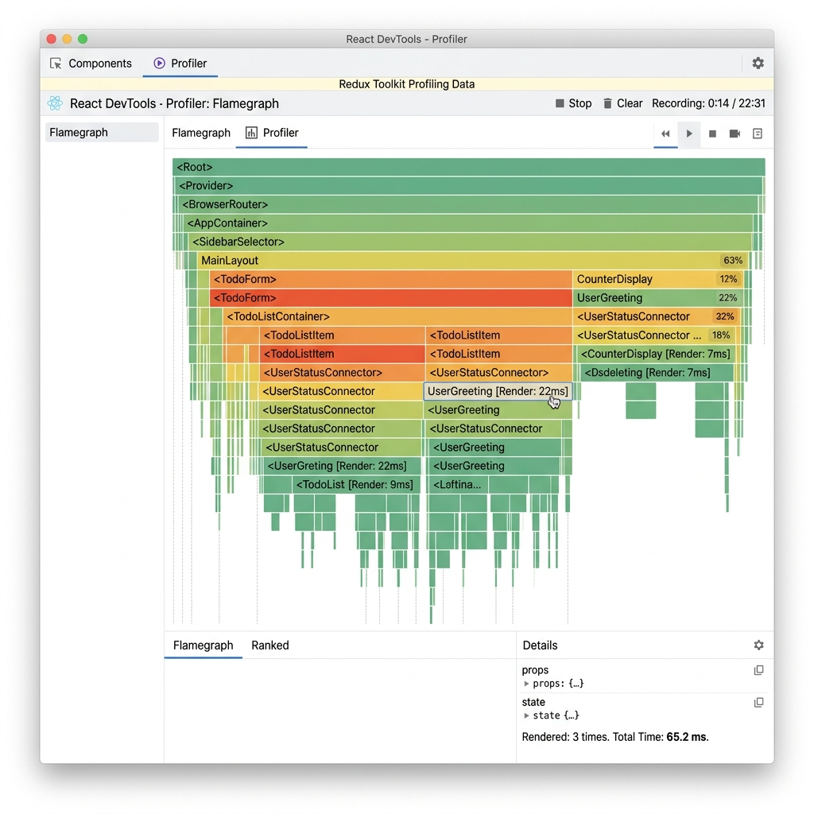
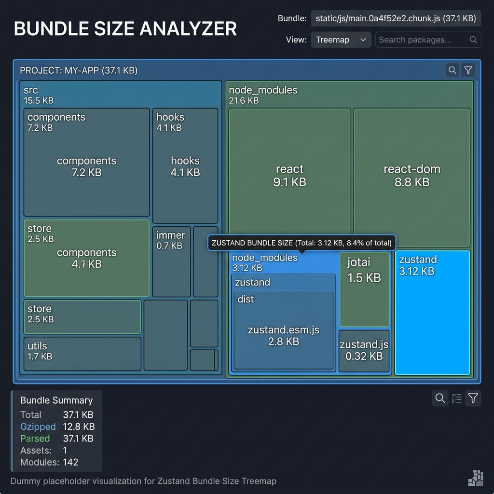

# React State Management Comparison: Context API vs. Zustand vs. Redux Toolkit

> **A production-ready technical benchmark evaluating React state management architectures.** This repository presents a premium e-commerce application implemented identically across Context API, Zustand, and Redux Toolkit. It provides an empirical analysis of render optimization, bundle size footprints, and developer experience to guide architectural decision-making for scalable frontend applications.

## 🎯 Overview & Objectives
This project is an advanced frontend development exercise designed to benchmark three of the most popular state management solutions in the React ecosystem: **React Context API**, **Zustand**, and **Redux Toolkit (RTK)**.

The objective is to build an identical, premium Shopping Cart application across multiple implementations to directly compare:
1. **Performance**: Specifically targeting and analyzing unnecessary re-renders using the React DevTools Profiler.
2. **Bundle Size**: Measuring the footprint of the state management library on the final build using bundle analyzers.
3. **Developer Experience (DX)**: Evaluating boilerplate, code organization, and ease of use.

## 🏗️ Repository Structure

- [`base-app/`](./base-app): The initial scaffolded application containing the dummy data and CSS.
- [`context-version/`](./context-version): The Naive Context API implementation (single context causing widespread re-renders).
- [`context-version-optimized/`](./context-version-optimized): The Optimized Context API implementation (split contexts to isolate state changes).
- [`zustand-version/`](./zustand-version): The Zustand implementation, demonstrating hook-based minimal-boilerplate state management.
- [`redux-version/`](./redux-version): The Redux Toolkit implementation, showcasing structured, slice-based state management.
- [`profiling/`](./profiling): React DevTools flamegraph screenshots for performance comparison.
- [`bundle-analysis/`](./bundle-analysis): Bundle visualizer screenshots for size comparison.
- [`RESULTS.md`](./RESULTS.md): Comprehensive breakdown of metrics, trade-offs, and final architectural recommendations.
- `docker-compose.yml` & `Dockerfile`: Standardized environment for running the production build of the Redux variant.

## 🚀 Instructions & Reproducibility

### Running Locally (Development Mode)
To run any of the variants on your local machine:
1. Navigate to the desired directory (e.g., `cd zustand-version`).
2. Install dependencies: `npm install`
3. Start the Vite development server: `npm run dev`
4. Open your browser to `http://localhost:5173`.

*Note: You can view render counts directly in the UI (e.g., next to "Your Cart" in the sidebar) which increment every time the component updates.*

### Running via Docker (Production Build)
To test a standardized production build of the Redux Toolkit version:
1. Ensure Docker Desktop is running.
2. In the root directory, run:
   ```bash
   docker-compose up --build -d
   ```
3. The application will be served via Nginx at `http://localhost:8080`.

### Reproducing the Profiling Metrics
1. Install the **React DevTools** browser extension.
2. Run any variant in development mode (`npm run dev`).
3. Open the browser Developer Tools and navigate to the "Profiler" tab.
4. Click "Record" (the blue circle).
5. Interact with the application (e.g., add an item to the cart, toggle the theme).
6. Click "Stop" to view the flamegraph and observe which components re-rendered and why.

### Reproducing Bundle Analysis
Each variant can be built using `npm run build`. To analyze the bundle, you can install `rollup-plugin-visualizer` into the `vite.config.js` of any variant and generate a visual treemap of the bundle size.

## 🧪 Testing & Code Quality
While state management architectures heavily influence code quality, testing acts as the ultimate verifier. The repository includes an example of a robust unit test suite configured via **Vitest**.
- **Redux Toolkit Test**: See [`redux-version/src/store/cartSlice.test.js`](./redux-version/src/store/cartSlice.test.js) for an example of how isolated logic tests are written for Redux reducers.
- To run the tests:
  ```bash
  cd redux-version
  npm install
  npm test
  ```
The application enforces strict React patterns (Hooks, Context, pure components) and maintains functional parity across all 3 variants to ensure the comparison is 1:1. 

## 📊 Results Summary & Metrics

Below is a snapshot of our final benchmarks comparing render efficiency and bundle footprints. For the full deep-dive and decision guide, please read [RESULTS.md](./RESULTS.md).

### Benchmark Comparison Table

| Metric | Context (naive) | Context (split) | Zustand | Redux Toolkit |
| :--- | :--- | :--- | :--- | :--- |
| **Render Efficiency** | 🔴 Cascading | 🟢 Isolated | 🟢 Isolated | 🟢 Isolated |
| **Bundle Size Impact**| 0 KB (Built-in) | 0 KB (Built-in) | ~1.1 KB | ~3.1 KB |
| **Boilerplate Cost**  | Minimal | Medium | Minimal | High |
| **Final Verdict**     | **Avoid** | **Good** | **Best for 80%** | **Best for Scale**|

### Visual Proof

#### Profiling Highlights
*(Example: Redux Toolkit Flamegraph showing isolated component updates)*


#### Bundle Analysis
*(Example: Zustand's minimal ~1KB bundle footprint)*


> **Live Demos**: To be deployed to Vercel. For now, pull the repository and run `npm run dev` in any folder, or use the root `docker-compose up` for the Redux production build.
