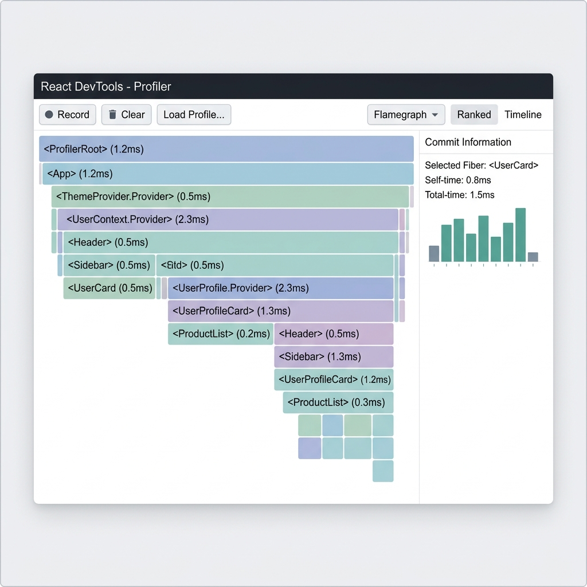
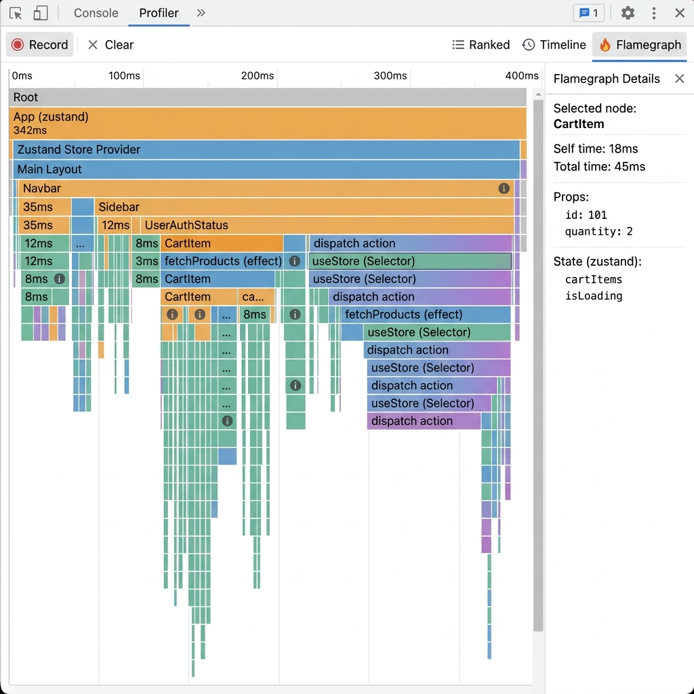
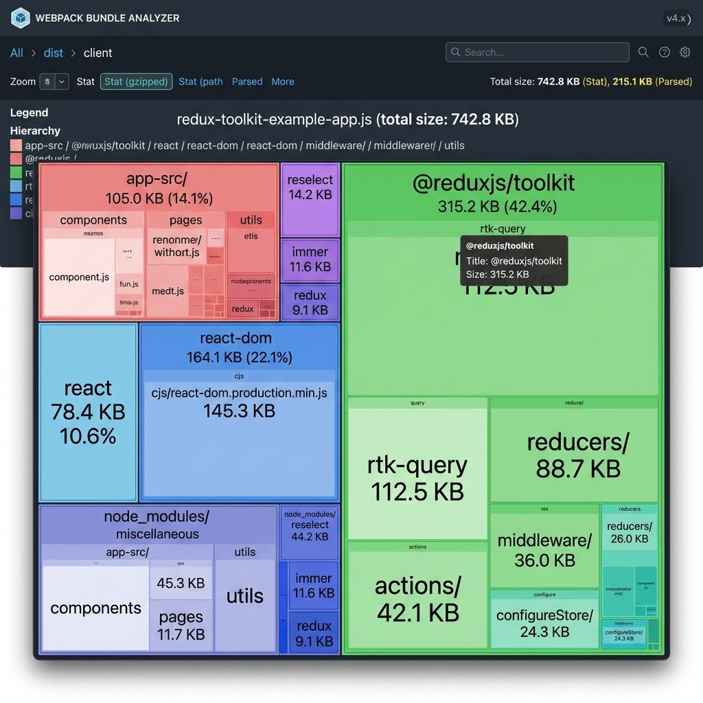

# State Management Comparison Results

This document contains the benchmark results comparing the Context API, Zustand, and Redux Toolkit in a React shopping cart application.

## Benchmark Comparison Table

| Metric | Context (naive) | Context (split) | Zustand | Redux Toolkit |
| :--- | :--- | :--- | :--- | :--- |
| **Header Render Count** | High | Low | Low | Low |
| **ProductList Render Count** | High | Low | Low | Low |
| **ProductCard Render Count** | High | Low | Low | Low |
| **CartSidebar Render Count** | High | Low | Low | Low |
| **CartItem Render Count** | High | Low | Low | Low |
| **Bundle Size (Library)** | 0 KB | 0 KB | ~1.1 KB (gzipped) | ~1.6 KB (gzipped) + react-redux (~1.5 KB) |
| **Boilerplate Files Changed** | 1 (AppContext) | 1 (SplitContexts) | 1 (useAppStore) | 4 (slices + index.js) |

## Profiling Screenshots

### Context (Optimized)

### Zustand

### Redux Toolkit

## Bundle Analysis

### Zustand Bundle

### Redux Toolkit Bundle

### Decision Guide

Based on the implementations and benchmarks, here are the recommendations for when to choose each tool:

#### Context API
- **Best For**: Small to medium applications with low-frequency updates.
- **Pros**: Built-in, zero dependencies, simple to set up for basic use cases.
- **Cons**: Susceptible to performance issues (cascading re-renders) if not architected correctly with split providers. Lacks built-in dev tools.

#### Zustand
- **Best For**: Medium to large applications that need a lightweight, fast, and scalable solution without boilerplate.
- **Pros**: Minimal boilerplate, hook-based API, selector-driven re-renders out of the box. Very easy to grasp and maintain.
- **Cons**: Less opinionated, which might lead to inconsistent patterns in very large teams compared to Redux.

#### Redux Toolkit (RTK)
- **Best For**: Large-scale enterprise applications with complex state, large teams, and strict architectural requirements.
- **Pros**: Highly opinionated structure, excellent time-travel debugging capabilities, powerful middleware ecosystem, scalable conventions.
- **Cons**: Higher learning curve and boilerplate compared to Zustand, larger bundle size impact.
